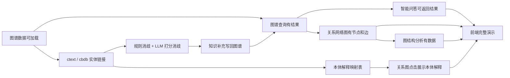

# Bug 清单与模块分工

更新时间：2026-06-17
功能完成节点：2026-06-20
最终验收与 PPT 完善节点：2026-06-21

本项目一共四个人，包含队长。分工按模块拆，每个人负责把自己的模块真正调通：能跑、能展示、有结果、有错误提示。前端美化由队长统一收口，各模块负责人配合保证自己模块能在页面上展示。

## 总目标

6 月 20 日前完成：

1. 智能问答有结果。
2. 图谱查询有结果。
3. 实体链接与知识补充有 ctext / cbdb 对齐结果。
4. 关系网络图有节点和边。
5. 图结构分析基于关系网络图数据产生结果。
6. 本体解释能在关系网络图中通过点击节点或边展示。
7. 前端页面能完整演示以上功能。

6 月 21 日只做最终验收、小 bug 修补、PPT 完善和演示排练，不再做大范围重构。

## 功能依赖关系



说明：关系网络图展示的是实例层，点击节点或边时展示本体层解释。图结构分析必须基于关系网络图同源数据，不能单独造 mock 数据。

## 四人模块分工

### 1. 队长：集成、版本同步、前端美化、最终验收与 PPT

简单说明：队长不负责单独修完所有业务功能，主要负责把四个人的模块合到最新版本，并保证最后能演示。

负责内容：

- 维护 `main` 或 `develop` 的最新可运行版本。
- 每天确认四个人是否已经 `git pull --rebase`。
- 统一检查提交，避免旧代码覆盖新代码。
- 统筹前端页面美化和演示体验收口。
- 负责最终演示流程、PPT 结构、答辩口径。
- 判断 6 月 21 日哪些问题能修，哪些问题只做兜底说明。

重点文件：

- `BUGS_AND_TASKS.md`
- `docs/team_sync_rules.md`
- `docs/demo_script.md`
- `README.md`
- `templates/index.html`
- `static/styles.css`
- PPT 文件

6 月 20 日前必须完成：

- 建立 Git 同步规定。
- 确认每个模块负责人知道自己的接口和验收标准。
- 每天至少做一次集成检查。
- 在功能稳定后统一做前端美化。
- 把所有已调通功能整理成演示流程。

6 月 21 日必须完成：

- 跑完整演示。
- 完善 PPT。
- 记录未解决问题和答辩兜底说法。

验收标准：

- 队长本机能从最新代码启动项目。
- 首页、问答、图谱查询、实体链接、关系网络图、图结构分析、本体解释都能进入演示。
- PPT 中的系统架构、模块分工、核心功能、问题与改进都能对应到实际项目。

### 2. 智能问答负责人

简单说明：负责用户问一句话后系统能回答。优先保证固定工具查询有结果，再保证复杂问题能走生成式 SPARQL 或 fallback。

负责文件：

- `src/workflow.py`
- `src/tool_calling_workflow.py`
- `src/langchain_tools.py`
- `src/llm_workflow_support.py`
- `src/fewshot_sparql.py`
- `data/examples/fewshot_sparql.md`

必须调通：

- 普通问答接口：`POST /api/query`
- 固定工具查询链路
- 大模型生成 SPARQL 进行复杂查询，并有结果返回
- 工具和复杂查询都失败时进入 fallback 链路，给出提示，并让大模型尝试回答
- few-shot SPARQL 示例

最低可演示问题：

- `文彭的字是什么？wei`
- `文彭的号是什么？`
- `文彭的师承关系有哪些？`
- `文彭和文徵明是什么关系？`

验收标准：

- 页面智能问答输入问题后有结果。
- 返回内容中至少包含回答文本。
- 如果走 SPARQL，能显示对应 SPARQL。
- 至少 3 个演示问题能稳定返回。

### 3. 图谱查询、实体链接、知识补充与本体说明负责人

简单说明：这个模块是图谱底座。图谱查询基本调通后，主要补齐 ctext / cbdb 实体链接、大模型打分消歧，以及供前端点击展示用的本体解释映射表。

负责文件：

- `data/kg/schema.ttl`
- `data/kg/core.ttl`
- `data/kg/aligned.ttl`
- `data/kg/alignment_rules.md`
- `data/intermediate/entities.json`
- `data/intermediate/relations.json`
- `src/graph_store.py`
- `src/tools.py`
- `src/web.py` 中 `/api/sparql`
- 实体链接、对齐、知识补充相关脚本或模块
- 本体解释映射表，例如 `data/kg/ontology_explanations.json`

必须调通图谱查询：

- TTL 文件加载。
- `POST /api/sparql` 查询接口。
- 图谱查询页面默认示例。
- 人物、关系、流派三类基础查询。

最低可演示查询：

```sparql
PREFIX rdf: <http://www.w3.org/1999/02/22-rdf-syntax-ns#>
PREFIX rdfs: <http://www.w3.org/2000/01/rdf-schema#>
PREFIX yrz: <http://example.org/yinrenzhuan#>

SELECT ?person ?label
WHERE {
  ?person rdf:type yrz:Person ;
          rdfs:label ?label .
}
LIMIT 10
```

必须调通实体链接与知识补充：

- 使用 ctext / cbdb 对抽取人物进行候选检索。
- 对同名人物建立规则消歧，例如时间、生卒年、朝代、籍贯、字、号等信息。
- 在规则无法唯一确定时，加入大模型打分消歧。
- 大模型打分要输出候选条目、分数、理由，不能只输出一个最终答案。
- 将 ctext / cbdb 中可补充的知识写回本知识图谱，例如 `owl:sameAs`、外部 ID、生卒年、朝代、籍贯、相关条目链接等。

必须准备本体解释映射表：

- 说明每类关系对应的本体属性。
- 给出中文名、英文属性名、domain、range、解释。
- 交给关系网络图负责人接入点击展示。

示例结构：

```json
{
  "hasTeacher": {
    "label": "师承",
    "property": "yrz:hasTeacher",
    "domain": "Person",
    "range": "Person",
    "description": "表示人物之间的师承关系。"
  },
  "belongsToSchool": {
    "label": "所属流派",
    "property": "yrz:belongsToSchool",
    "domain": "Person",
    "range": "School",
    "description": "表示人物所属的篆刻或印学流派。"
  }
}
```

实体链接最低可演示案例：

- `文彭` 能对应到 ctext 或 cbdb 中的候选条目。
- 当 ctext / cbdb 存在多个同名候选时，先用规则过滤，再用 LLM 打分排序。
- 对齐结果能写入 `data/kg/aligned.ttl` 或明确的补充文件。
- 图谱查询能查到至少一条补充后的知识。

验收标准：

- `GET /api/health` 显示 `schema`、`core`、`aligned` 文件存在。
- 图谱查询页面点击“执行查询”后表格有数据。
- 默认 SPARQL 至少返回 1 行。
- 至少 3 条 SPARQL 示例能稳定返回。
- 实体链接结果中能看出外部来源、候选、规则依据、LLM 分数和最终选择。
- 知识补充后的结果能通过 SPARQL 查出来。
- 本体解释映射表至少覆盖 `hasTeacher`、`fatherOf`、`hasFriend`、`belongsToSchool`、`foundsSchool`。

### 4. 关系网络图、图结构分析与本体解释展示负责人

简单说明：负责把图谱关系变成可视化网络，并基于同一批节点和边做结构分析。本体解释只负责“展示接入”，解释内容由图谱查询与实体链接负责人提供。

负责文件：

- `src/graph_analysis.py`
- `src/service.py`
- `src/web.py` 中 `/api/graph-explore`、`/api/graph-analysis`、`/api/graph-path`
- `templates/index.html`
- `static/styles.css`
- 相关测试文件

必须调通关系网络图：

- `GET /api/graph-explore`
- `GET /api/person-detail`
- 关系网络图所需节点和边结构
- 前端网络图节点和边渲染

必须调通图结构分析：

- `GET /api/graph-analysis`
- `POST /api/graph-path`
- 中心性分析
- 社区分析
- 路径分析
- 流派分析

必须接入本体解释展示：

- 点击人物节点时，展示本体类型，例如 `yrz:Person`。
- 点击流派节点时，展示本体类型，例如 `yrz:School`。
- 点击关系边时，根据 `relationType` 查映射表，展示：
  - 实例关系：例如 `文彭 --师承--> 文徵明`
  - 本体属性：例如 `yrz:hasTeacher`
  - 定义域：`Person`
  - 值域：`Person`
  - 说明：表示人物之间的师承关系

验收标准：

- `/api/graph-explore?hop=1` 返回 `nodes.length > 0` 和 `edges.length > 0`。
- 每条边包含 `source`、`target`、`relationType`、`relationLabel`。
- 每个节点包含 `id`、`label`、`type`。
- `/api/graph-analysis` 返回：
  - `summary`
  - `centrality`
  - `communities`
  - `schoolEvolution`
- 图结构分析不能使用单独 mock 数据，必须使用关系网络图同源数据。
- 点击边能显示本体解释。
- 点击节点能显示本体类型。

## 前端页面与美化安排

前端美化必须放在功能调通之后。队长负责整体风格收口，但各模块负责人必须保证自己的模块在页面上能展示。

必须展示：

- 智能问答页面交互。
- 图谱查询页面结果展示。
- 实体链接与知识补充结果展示。
- 关系网络图渲染。
- 点击节点或边时的本体解释。
- 图结构分析结果展示。
- 空状态、错误状态、加载状态。

时间安排：

- 6 月 17 日到 6 月 19 日：优先保证功能可用。
- 6 月 20 日：功能基本稳定后做页面美化和展示优化。
- 6 月 21 日：只做小范围视觉修补，不做大改版。

验收标准：

- 首页能正常打开。
- 智能问答能提交并显示结果。
- 图谱查询能显示表格。
- 实体链接能显示对齐结果或打分结果。
- 关系网络图能看到节点和边。
- 点击关系边能看到本体属性解释。
- 图结构分析能显示数据卡片。
- 页面用于答辩演示时不出现明显错位、遮挡、按钮不可点。

## 时间安排

### 6 月 17 日

- 队长确认最新代码和分工。
- 图谱查询与实体链接负责人确认 TTL 能加载，确认 ctext / cbdb 对齐方案。
- 智能问答负责人确认 `/api/query` 当前错误原因。
- 关系网络图与分析负责人确认 `/api/graph-explore` 和 `/api/graph-analysis` 是否有数据。
- 队长确认页面按钮、接口调用和错误提示现状。

### 6 月 18 日

- 图谱查询至少有一个稳定查询结果。
- 实体链接完成候选检索和规则消歧原型。
- 本体解释映射表完成初版。
- 智能问答至少调通 2 个固定问题。
- 关系网络图接口返回节点和边。
- 前端完成基础结果展示，不追求美化。

### 6 月 19 日

- 智能问答补足 3 到 5 个演示问题。
- 图谱查询补足 3 条演示 SPARQL。
- 实体链接完成规则消歧 + LLM 打分消歧演示案例。
- 关系网络图能按人物展开。
- 图结构分析能显示中心性、社区、路径或流派分析。
- 关系网络图能点击边显示本体解释。

### 6 月 20 日

- 所有模块完成最低可演示版本。
- 实体链接与知识补充能在 PPT 或页面中展示完整链路。
- 本体解释能在关系网络图中展示。
- 前端开始集中美化。
- 队长跑完整演示流程。
- 冻结接口路径和数据路径。

### 6 月 21 日

- 最终验收。
- 完善 PPT。
- 排练答辩。
- 只修小 bug，不做大改。

## 每个模块提交前检查

所有人提交前必须执行：

```powershell
cd "D:\cxdownload\kg agent\kg_agent_app"
git status
python -m pytest tests/test_config_openai.py -q
```

后端相关模块还要检查：

```powershell
python app.py
```

然后用浏览器或 curl 验证自己负责的接口。

## 统一协作规定

所有人必须遵守：

- 开始工作前先 `git pull --rebase`。
- 不直接在 `main` 上开发。
- 不复制旧目录继续开发。
- 不新增 `data2`、`最终版`、`我的版本` 这类目录。
- 不提交 `.env`。
- 不提交 `__pycache__`。
- 不改别人的模块接口，除非先通知队长。
- 不用假数据冒充功能调通。
- ctext / cbdb 不可访问时，可以使用缓存结果演示，但必须标注来源和生成时间。

## Git 分支与同步命令说明

本项目建议使用两个分支：

- `main`：最终稳定演示分支。6 月 21 日最终验收时，优先从这个分支启动项目。
- `develop`：四个人日常开发和联调用的分支。平时修 bug、调模块、合并功能都先放到这个分支。

简单理解：平时大家都在 `develop` 上干活，队长确认功能稳定后，再把 `develop` 合并到 `main`。

### 队长第一次创建 develop 分支

```powershell
cd "D:\cxdownload\kg agent\kg_agent_app"

git status
git checkout main
git pull --rebase origin main

git checkout -b develop
git push -u origin develop
```

命令说明：

- `cd "D:\cxdownload\kg agent\kg_agent_app"`：进入项目主工程目录。
- `git status`：查看当前有没有未提交的修改，避免误把临时文件提交上去。
- `git checkout main`：切换到正式稳定分支。
- `git pull --rebase origin main`：把 GitHub 上 `main` 的最新代码同步到本地。
- `git checkout -b develop`：从当前 `main` 创建一个新的 `develop` 开发分支。
- `git push -u origin develop`：把本地 `develop` 分支上传到 GitHub，并建立默认关联。

### 成员每天开始写代码前执行

```powershell
cd "D:\cxdownload\kg agent\kg_agent_app"

git checkout develop
git pull --rebase origin develop
```

命令说明：

- `git checkout develop`：切换到团队开发分支，保证自己是在正确分支上写代码。
- `git pull --rebase origin develop`：从 GitHub 拉取其他成员最新提交的代码，并把自己本地未推送的提交接到最新代码后面。

这一步的目的：避免成员基于旧代码继续开发，减少“别人已经改好了但我本地还是旧版本”的问题。

### 成员完成自己模块后提交

```powershell
git status
git add .
git commit -m "fix: 完成自己的模块说明"
git pull --rebase origin develop
git push origin develop
```

命令说明：

- `git status`：确认自己改了哪些文件。
- `git add .`：把当前目录下的修改加入本次提交。
- `git commit -m "fix: 完成自己的模块说明"`：提交本次修改，提交说明要写清楚自己完成了什么，例如 `fix: 修复图谱查询无结果问题`。
- `git pull --rebase origin develop`：推送前再次同步远程最新代码，避免覆盖别人刚提交的内容。
- `git push origin develop`：把自己的提交上传到 GitHub 的 `develop` 分支。

注意：如果 `git status` 里出现 `.env`、`__pycache__`、临时数据目录、无关文档，不要直接提交，先删除或加入 `.gitignore`。

### 队长在 6 月 20 日将 develop 合并到 main

```powershell
git checkout main
git pull --rebase origin main

git merge develop
git push origin main
```

命令说明：

- `git checkout main`：切回最终稳定分支。
- `git pull --rebase origin main`：先同步 GitHub 上最新的 `main`。
- `git merge develop`：把 `develop` 中已经调通的功能合并到 `main`。
- `git push origin main`：把最终稳定版本上传到 GitHub。

合并前要求：队长必须先确认 `develop` 能启动、核心功能能演示、测试能通过，再合并到 `main`。

## 队长合并顺序

建议合并顺序：

1. 图谱查询、实体链接、知识补充与本体说明模块。
2. 关系网络图、图结构分析与本体解释展示模块。
3. 智能问答模块。
4. 前端页面与美化收口。
5. PPT 和演示文档。

原因：查询和实体链接是底座，本体解释映射表先准备好，关系网络图才能接入展示；网络图和分析依赖图谱数据，问答也依赖查询链路，前端最后统一接真实接口和做美化。

## 最终验收清单

6 月 21 日验收时逐项打勾：

- [ ] 项目能从最新代码启动。
- [ ] 图谱 TTL 能加载。
- [ ] 图谱查询有结果。
- [ ] 实体链接有 ctext / cbdb 对齐结果。
- [ ] 同名人物有规则消歧和 LLM 打分消歧说明。
- [ ] 知识补充结果能写回图谱并被 SPARQL 查到。
- [ ] 本体解释映射表已准备。
- [ ] 关系网络图点击边能显示本体解释。
- [ ] 智能问答有结果。
- [ ] 关系网络图有节点和边。
- [ ] 图结构分析有数据。
- [ ] 前端页面没有明显错位。
- [ ] PPT 已更新为最新分工和功能截图。
- [ ] 演示脚本已准备。
- [ ] 每个人知道自己答辩时负责讲哪一部分。
